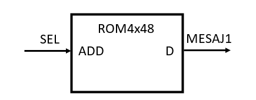
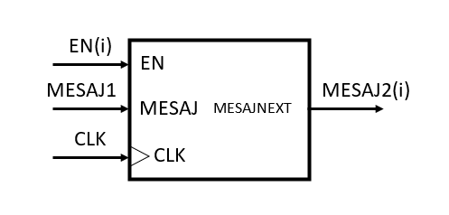
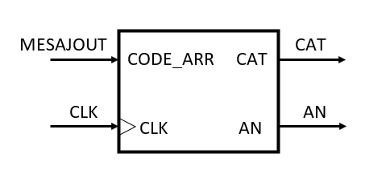
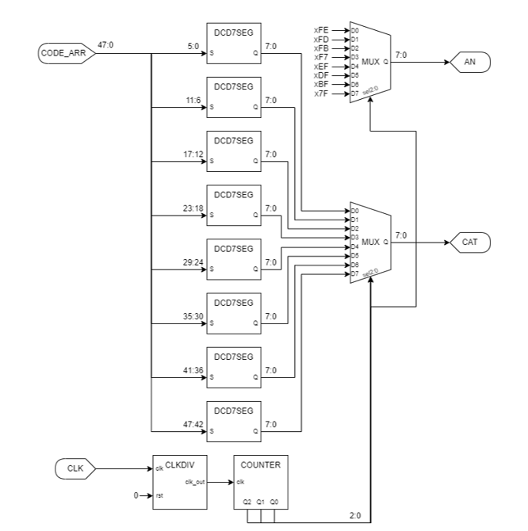
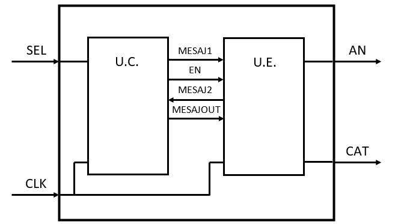
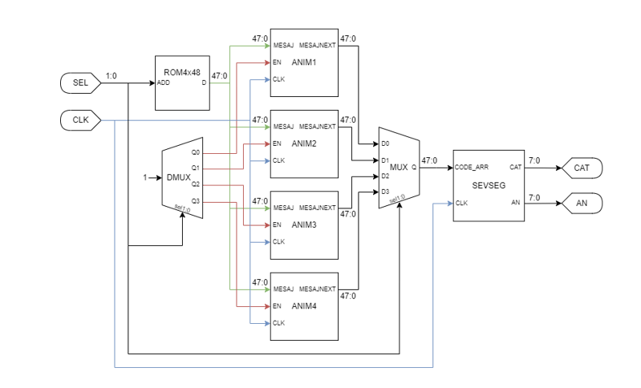

# Animated Publicity System using 7-Segment Display

This project implements a system to display animated publicity messages on 7-segment displays using an FPGA. It allows for the selection of different animation modes to present text in various dynamic ways.

## Table of Contents

* [Specifications](#specifications)
* [Design](#design)
    * [Block Diagram](#block-diagram)
    * [Control Unit and Execution Unit](#control-unit-and-execution-unit)
        * [Input/Output Mapping](#inputoutput-mapping)
        * [Control Unit Resources](#control-unit-resources)
        * [Execution Unit Resources](#execution-unit-resources)
        * [Control Unit and Execution Unit Connections](#control-unit-and-execution-unit-connections)
        * [Detailed Project Schematic](#detailed-project-schematic)
* [Usage](#usage)
* [Justification](#justification)
* [Future Developments](#future-developments)
* [Author](#author)

## Specifications

The system is designed to display animated publicity messages using 7-segment displays.

* The displayed text is composed of symbols from a defined alphabet.
* The system supports multiple animation modes, selectable by the user via FPGA board switches.
* The FPGA's built-in quartz oscillator is used as the clock source (with necessary division).
* Examples of animation modes include:
    * Text scrolling from right to left.
    * Text blinking.
    * Character-by-character display.
* The messages are stored in memory for easy modification.

## Design

### Block Diagram

### Control Unit and Execution Unit

The system is divided into a Control Unit (U.C.) and an Execution Unit (U.E.).

#### Input/Output Mapping

* **SEL:** Animation selection input.
* **CLK:** Clock input.
* **AN:** Anode control output for 7-segment displays.
* **CAT:** Cathode control output for 7-segment displays.

#### Control Unit Resources

* **ROM4x48:**
    * A 4x48-bit ROM is used to store the encoded messages.
    * The 2-bit address input (ADD) selects one of the four messages.
    * Each message is 48 bits long, encoding 8 characters (6 bits per character).
    * The message is selected based on the chosen animation.

    * **ROM Content Example:**

        | ADD | D              | Decoded Message       |
        | :-- | :------------- | :-------------------- |
        | 00  | 0x31730A31754A | COCACOLA              |
        | 01  | 0x31730A31754A | COCACOLA              |
        | 10  | 0x8E49669E8A6A | Special Symbols       |
        | 11  | 0x000000000000 | Loading bar           |

* **DMUX1x4:**

  * A 1x4 demultiplexer with a 2-bit selection input (SEL) is used to activate only the selected animation and deactivate the others.
  * The output signal (EN) controls the start/reset of each animation in the Execution Unit.

* **MUX4x1:**

  * A 4x1 multiplexer with 2-bit selection inputs and 48-bit inputs/output.
  * It selects the message generated by the active animation in the Execution Unit (MESAJOUT).

#### Execution Unit Resources

* **Animations (ANIMATIE1, ANIMATIE2, ANIMATIE3, ANIMATIE4):**
    * Each animation has the same block diagram structure but different internal logic.
    * **EN:** Input to enable/disable the animation (EN='1' for active, EN='0' for reset).
    * Animations are reset when another animation is selected, resetting their internal counters and message output (MESAJNEXT = xFFFFFFFFFFFF - representing spaces).
    * Each animation has a different internal clock frequency.
    * MESAJNEXT: Output signal specifying the message for the next frame.

    * **Animation Examples:**
        * **ANIMATIE1 (Scroll Left):** Shifts the input message (MESAJ) one character to the left on each clock cycle.
        * **ANIMATIE2 (Blink):** Alternates between displaying the message (MESAJ) and displaying spaces (xFFFFFFFFFFFF) on each clock cycle.
        * **ANIMATIE3 (Loading - Cascading):** Uses cascaded modulo-8 counters to progressively reveal characters of the message.
        * **ANIMATIE4 (Loading - Variable Time):** Loads characters sequentially with a variable clock frequency.

* **SEVENSEGMENT:**

  

    * This component converts the message codes into the appropriate signals for the 7-segment displays (cathode and anode control).
    * It operates at a 60Hz refresh rate.
    * It receives the message as an array of character codes (CODE_ARR).
    * It uses multiple sub-components:
        * **DCD7SEG:**

          

            * Decodes each character code into the 7-segment display pattern. 
            * Supports digits (0-9), Latin alphabet (excluding M, V, W, Z), special characters ('.', '!', '?'), and 8 custom characters.
        * **MUX8x1:**

          

            * Two 8x1 multiplexers are used.
            * One selects the cathode data for the current display.
            * The other activates a single anode at a time for multiplexing the displays.
            * The selection is controlled by an internal modulo-8 counter (an\_counter).
              
  

#### Control Unit and Execution Unit Connections

#### Detailed Project Schematic

## Usage

* Animations are selected using the first two switches on the FPGA board:
    * "00": Animation 1 (Right-to-left scroll)
    * "01": Animation 2 (Blink)
    * "10": Animation 3 (Loading - Cascading)
    * "11": Animation 4 (Loading - Variable Time)

## Justification

* The chosen design prioritizes memory efficiency and code simplicity, allowing for easier future modifications.
* The message length is limited to 8 characters due to the complexity of implementing a variable-length message algorithm for Animation 2.
* Supporting variable-length messages would require significant parameterization of components.
* Using 8 separate DCD7SEG components simplifies the character decoding process, although it could be optimized by decoding characters only when they are displayed.

## Future Developments

* Possible future improvements include:
    * Adding more animation modes.
    * Supporting variable-length text by increasing message memory, parametrizing components, and implementing a message decomposition algorithm.
